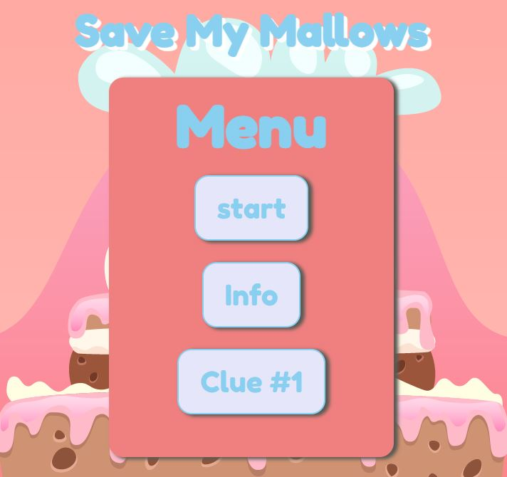

<h1 align="center"><u>Save My Mallows</u></h1>
 

 
<h3 align="center"><u>About</u></h3>

This project is a *JavaScript* built game. In the game you are helping Marty the Marshmallow escape a room, Hattie the Hot Choclate has trapped him in. You will use clues to find a number combination that will let you escape.

 
 
<h3 align="center"><u>How it works: Menu</u></h3>

I used event listeners to create the menu page, this allowed me to run functions that will change the DOM to create Info and Clue cards to change the HTML. I have also used the event listeners to create a home button that will refresh the page so the user doesn't have to use the back button.

 
 
<h3 align="center"><u>How it works: The Game</u></h3>

I used a seperate HTML and JS file for the game page to keep my code organised, and have the actual game function seperatly to the home screen. The game runs through buttons using Event listeners to reveal the clues. The Marty Marshmallow image is used to refresh the page, it also works as interaction for the user "As they give the clues to Marty" To win you need to enter the right numbers in the If statment to call on a function that will bring up the You Won Screen. However if the user clicks three times, and it isn't the correct places another function will be called for a Game Over Screen.

 
 
<h3 align="center"><u>Progress</u></h3>
 

 This is my second JavaScript project, I learnt a lot from my this project. Using DOM for the first time in a project, I found out how powerful it can be to use JavaScript to change an entire page. I had many issues creating this game. Creating the actual "Game Board" was difficult, I tried to use Grid so that I could use Divs as my Event Listeners. But after many tries I had to settle for invisible buttons. This presented another issue, being responsive. The game as it stands would need a lot of media queries to work on different screens, due to the buttons moving as the screen changes.

  
 
<h3 align="center"><u>Features to be added</u></h3>
 
 

Resolve responsive issues. 
Add another level. 
Add a difficulty that changes the riddles to be harder 

  
 
<h3 align="center"><u>Credit</u></h3>
 

This project was built as part of my training with _nology, so part of the credit goes to the coaches that have trained me on the usage and fundamentals of HTML, CSS and JavaScript.

